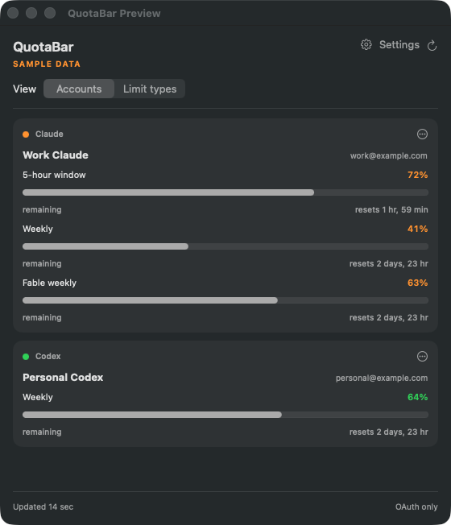
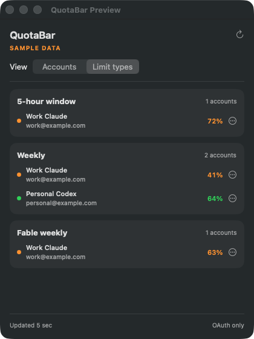
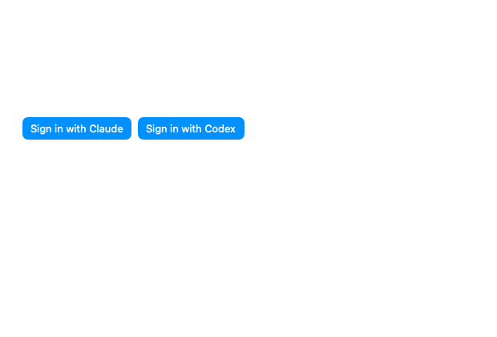

# QuotaBar

**Claude と Codex の OAuth サブスクリプション使用量を macOS メニューバーで確認するアプリ**

複数アカウントの制限をアカウント別・制限種類別に比較し、表示名とメールアドレスの表示ポリシーも管理できます。

[한국어](README.ko.md) · [English](README.md) · [日本語](README.ja.md) · [简体中文](README.zh-CN.md) · [Español](README.es.md)

<p>
  <a href="https://github.com/Supia7/quota-bar"></a>
  <a href="https://github.com/Supia7/quota-bar"></a>
  <a href="https://github.com/Supia7/quota-bar"></a>
</p>

<p>
  
</p>

> **ステータス:** 初期公開版です。Claude と Codex の使用量 endpoint は安定した公開 billing API ではなく、各 coding client が利用する内部 endpoint です。変更時には推測値ではなく明示的なエラーを表示します。

## スクリーンショット

> 以下は `QuotaBarPreview` 専用 fixture の例です。実際のアプリを新規インストールすると、サンプルではなく空の状態が表示されます。

<table>
  <tr>
    <td width="33%"></td>
    <td width="33%"></td>
    <td width="33%"></td>
  </tr>
  <tr>
    <td align="center"><sub>Compact アカウント表示</sub></td>
    <td align="center"><sub>Compact 制限種類別表示</sub></td>
    <td align="center"><sub>Settings・OAuth 表示</sub></td>
  </tr>
</table>

## 表示できる使用量

### Claude

- 5時間 rolling window
- 全モデル共通の Weekly 制限
- Fable / model-scoped Weekly 制限
- Fable のデータがない場合は 0% と推測せず `Unavailable` を表示

### Codex

- OAuth サブスクリプションの Weekly 制限
- 残りの割合と reset 時刻

### アカウント管理

- アカウント数のハードリミットなし
- 固定 UUID で管理するため、同じメールアドレスでも別アカウントとして保持
- ローカル alias の編集
- アカウントごとのメール表示・非表示
- `Accounts` / `Limit types` ビューの切り替え
- アカウントごとの1行サマリーと展開可能な quota 詳細
- 選択したビューはローカルに保存

## インストール方法

### 一般ユーザー — DMG 推奨

1. [Releases](https://github.com/Supia7/quota-bar/releases/latest) から `QuotaBar-macos-arm64.dmg` をダウンロードします。
2. DMG を開き、`QuotaBar.app` を `Applications` にドラッグします。
3. 初回起動時に macOS の警告が表示されたら、アプリを右クリックして **開く** を選択します。

現在の release artifact は ad-hoc 署名です。Developer ID 署名と Apple notarization を追加するまでは、Gatekeeper が開発元の確認を求める場合があります。

### ターミナル — 最新 release を自動インストール

リポジトリを clone した後、次のコマンドを実行すると、Mac のアーキテクチャに合う release をダウンロードし、checksum を確認して `~/Applications` にインストールします。

```bash
./Scripts/install-release.sh
```

### 開発者 — ソースからビルドしてインストール

```bash
./Scripts/install.sh
```

release build、`.app` bundle の生成、ad-hoc 署名、`~/Applications/QuotaBar.app` へのコピー、起動までを行います。

### アップデート

QuotaBar は起動時と6時間ごとに GitHub Releases を確認します。v0.1.8 以降は Sparkle が署名済み HTTPS appcast と update archive を検証してから更新を提案します。更新には引き続きユーザーの承認が必要で、実行ファイルを無断で置き換えることはありません。

v0.1.7 は Sparkle 導入前のバージョンです。v0.1.7 のユーザーは DMG から v0.1.8 を一度手動でインストールしてください。v0.1.9 ではアプリ内 OAuth、v0.1.10 ではインストール場所の guard とロゴ、v0.1.14 では Codex loopback callback の自動完了を追加しました。

### 必要環境

- macOS 26+
- Swift 6.2+
- Claude と Codex のブラウザ OAuth ログイン

### ビルドと起動

```bash
swift run QuotaBarChecks
swift build --product QuotaBar
swift build --product QuotaBarPreview
swift run QuotaBar
```

`QuotaBarPreview` は同じ Monitor UI を通常のウィンドウで確認するための開発用 target です。

### アカウントを接続

Settings で `Sign in with Claude` または `Sign in with Codex` を選ぶと、ブラウザで OAuth ログインを開始します。Codex は登録済みの `http://localhost:1455/auth/callback` loopback redirect を使うため、承認後は通常 QuotaBar が自動で完了します。Claude は現在固定 HTTPS callback を使うため、完全な callback URL または一度だけ使える authorization code を QuotaBar に貼り付けます。Codex もローカル callback port を利用できない場合は貼り付け入力に fallback します。access / refresh token は貼り付けないでください。QuotaBar は code を交換し、実際の quota 応答を1回検証してから access / refresh token を macOS Keychain に保存します。

## セキュリティ境界

- 新しい OAuth token は `accounts.json` ではなく macOS Keychain に保存
- account registry には provider、alias、email、Keychain source、deduplication metadata のみ保存
- Keychain credential は provider token endpoint 経由でアプリが refresh
- 既存の CLI credential JSON はインポートしない
- OAuth 専用 — API key の billing 情報をサブスクリプション quota として扱わない
- authorize / token / usage endpoint は固定 HTTPS ポリシーで制限
- HTTP redirect を拒否
- Claude Web cookie の scraping なし
- 外部 CLI の実行なし
- telemetry / analytics なし
- Refresh は5分ごとに自動実行
- 手動 Refresh は即時 snapshot を取得
- Refresh に失敗しても最後に確認した画面を保持
- token 期限切れ・無効化時は再認証状態を表示

> Claude OAuth usage endpoint と Codex subscription usage endpoint は公開安定 API ではありません。schema や rate limit が変わった場合、推定値ではなく明示的なエラーを表示します。

## ローカル保存データ

| 場所 | 内容 |
| --- | --- |
| `~/Library/Application Support/QuotaBar/accounts.json` | provider、alias、email、Keychain source、deduplication identity |
| macOS Keychain (`com.supia.quotabar.oauth`) | アプリ内 OAuth の access / refresh token |
| `~/Library/Application Support/QuotaBar/display-preferences.json` | アカウントごとの alias / email 表示設定 |

OAuth access / refresh token はこれらのファイルに保存しません。

## 開発者向け

```text
Sources/QuotaBarCore/       モデル、decoder、credential boundary、provider client
Sources/QuotaBarUI/         メニューバー UI、5言語リソース、compact view、polling、account editor
Sources/QuotaBar/            メニューバー app entry point
Sources/QuotaBarPreview/     通常ウィンドウの Preview entry point
Sources/QuotaBarChecks/      framework-free self-check
```

検証:

```bash
swift run QuotaBarChecks
swift build --product QuotaBar
swift build --product QuotaBarPreview
git diff --check
```

現在の Command Line Tools 環境では XCTest/Testing module を利用できないため、framework-free self-check executable を使用しています。

## ロードマップ

- provider ポリシーが許せば manual callback paste ではなく native callback 処理
- Claude/Codex profile endpoint による email 自動取得
- アカウントごとの stale / re-auth 状態カード
- provider token rotation / revoke シナリオのテスト拡充
- full Xcode test target と signed/notarized release hardening の継続

## ライセンス

QuotaBar は [MIT License](LICENSE) で公開しています。商用利用、変更、再配布、fork を許可し、著作権表示とライセンス表示を維持してください。

## Repository

- GitHub: <https://github.com/Supia7/quota-bar>
- Plan: [`docs/2026-08-21-multi-account-oauth-plan.md`](docs/2026-08-21-multi-account-oauth-plan.md)
- Requirements: [`docs/2026-08-21-multi-account-oauth-requirements.md`](docs/2026-08-21-multi-account-oauth-requirements.md)
